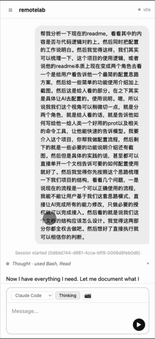

# RemoteLab

[中文](README.zh.md) | English

Control AI coding tools (Claude Code, Codex, Cline) from your phone mac or any other device! — no SSH, no VPN, just a browser.



---

## For Humans

### What it does

RemoteLab runs a lightweight web server on your **Mac or Linux server**. You point a Cloudflare tunnel at it, get an HTTPS URL, and from any browser (phone, tablet, whatever) you can open a chat interface that talks to Claude Code running on your machine.

Your sessions persist across disconnects. History is kept on disk. Multiple folders, multiple sessions, running in parallel.

### Get set up in 5 minutes — hand it to an AI

The fastest way to set this up is to paste the following prompt into Claude Code on your Mac or Linux server. The AI handles everything automatically. The only thing it'll stop and ask you for is a browser login to Cloudflare (unavoidable — they need to confirm you own the domain).

**Prerequisites before you paste the prompt:**
- **macOS**: Homebrew installed + Node.js 18+
- **Linux**: Node.js 18+ + `dtach` + `ttyd` (the setup wizard can install these automatically)
- At least one AI tool installed (`claude`, `codex`, `cline`, …)
- A domain pointed at Cloudflare ([free account](https://cloudflare.com), domain ~$1–12/yr from Namecheap or Porkbun)

---

**Copy this prompt into Claude Code:**

```
I want to set up RemoteLab on this Mac so I can control AI coding tools from my phone.

My domain: [YOUR_DOMAIN]          (e.g. example.com)
Subdomain I want to use: [SUBDOMAIN]  (e.g. chat — will create chat.example.com)

Please follow the full setup guide at docs/setup.md in this repository.
Do every step you can automatically. When you hit a [HUMAN] step, stop and tell me exactly what to do.
After I confirm each manual step, continue to the next phase.
```

Fill in your domain and subdomain, paste it, and follow the AI's instructions. You'll click through one Cloudflare browser login. Everything else is automated.

---

### What you'll have when done

Open `https://[subdomain].[domain]/?token=YOUR_TOKEN` on your phone:


- Create a session: pick a folder + AI tool
- Send messages — responses stream back in real time
- Close the browser, come back later — session is still alive
- Paste screenshots directly into the chat

### Daily usage

Once set up, the service auto-starts on boot (macOS LaunchAgent / Linux systemd). Just open the URL on your phone.

```
remotelab start          # start all services
remotelab stop           # stop all services
remotelab restart chat   # restart just the chat server
```

---

## Architecture

Two services run on your Mac behind a Cloudflare tunnel:

| Service | Port | Role |
|---------|------|------|
| `chat-server.mjs` | 7690 | **Primary.** Chat UI, spawns CLI tools, WebSocket streaming |
| `auth-proxy.mjs` | 7681 | **Fallback.** Raw terminal via ttyd — for emergencies only |

The Cloudflare tunnel routes your domain to the chat server (7690). The auth-proxy is localhost-only — if chat breaks badly enough, you SSH in and hit it directly.

```
Phone ──HTTPS──→ Cloudflare Tunnel ──→ chat-server :7690
                                              │
                                        spawns subprocess
                                        (claude / codex / cline)
                                              │
                                        streams events → WebSocket → browser
```

### Session persistence

Each chat session is a subprocess. When you disconnect, the process keeps running. When you reconnect, the server replays history and reattaches to the live stream.

#### Context persistence across restarts

RemoteLab maintains conversation context across server restarts using `claudeSessionId`:

```
First message: Claude Code outputs session_id: "abc123"
                    ↓
We capture & save: claudeSessionId → chat-sessions.json
                    ↓
Server restarts: Load from chat-sessions.json
                    ↓
Next message: --resume abc123 → Claude Code restores context from its internal storage
```

**Important:** Two separate storage systems exist:

| System | Location | Purpose |
|--------|----------|---------|
| RemoteLab chat-history | `~/.config/claude-web/chat-history/*.json` | Frontend display, history replay |
| Claude Code internal | `~/.claude/` (internal) | Claude's conversation context |

The chat-history files are **not** sent to Claude Code — they're only for the UI. Context continuity relies on `--resume` with the session ID, which tells Claude Code to load its own stored conversation history.

#### Tool switching clears context

Switching between tools (e.g., `claude` → `claude-aliyun`) clears the session ID because:

1. Different tools have independent session systems
2. A session ID from one backend won't work with another
3. This prevents confusion from "remembered" context that the new tool doesn't actually have

#### Compact function

The "Compact" button strips tool results from history while keeping text messages:

- **Does NOT modify** history files — original records are preserved
- Extracts `message` type events into a transcript stored in memory
- On next message, injects this transcript as a preamble
- After injection, the in-memory `compactContext` is cleared

Use Compact when context is getting long but you want Claude to remember the conversation.

---

## CLI Reference

```
remotelab setup                Run interactive setup wizard
remotelab start                Start all services
remotelab stop                 Stop all services
remotelab restart [service]    Restart: chat | proxy | tunnel | all
remotelab chat                 Run chat server in foreground (debug)
remotelab server               Run auth proxy in foreground (debug)
remotelab generate-token       Generate a new access token
remotelab set-password         Set username & password (alternative to token)
remotelab --help               Show help
```

## Configuration

| Variable | Default | Description |
|----------|---------|-------------|
| `CHAT_PORT` | `7690` | Chat server port |
| `LISTEN_PORT` | `7681` | Auth proxy port |
| `SESSION_EXPIRY` | `86400000` | Cookie lifetime in ms (24h) |
| `SECURE_COOKIES` | `1` | Set `0` for localhost without HTTPS |
| `ASSISTANT_DIR` | `~/Development/assistant` | Personal assistant directory for memory/knowledge |

## Personal Assistant Directory

RemoteLab includes a **Personal Assistant** feature — a "global context infrastructure" that gives AI assistants persistent memory across sessions. Instead of starting fresh every time, your AI can read your preferences, past insights, and working patterns.

### The Problem It Solves

Every time you start a new session with Claude Code or similar tools, the AI has no context about:
- Your communication style and preferences
- Projects you're working on
- Decisions you've made and why
- Insights from previous conversations

This directory solves that by providing structured files that AI reads at session start.

### Setting Up

By default, the assistant directory is `~/Development/assistant`. Customize with:

```bash
export ASSISTANT_DIR=~/my-assistant
```

### Directory Structure

When you click "Initialize" in the Files panel, RemoteLab creates:

```
~/Development/assistant/
├── rules/                       # Global constraints (AI reads these first)
│   ├── USER.md                  # Your profile: interests, habits, preferences
│   ├── SOUL.md                  # AI identity: how it should behave
│   ├── COMMUNICATION.md         # Communication style guidelines
│   ├── WORKSPACE.md             # Project index and file routing
│   ├── axioms/                  # Decision principles from your experience
│   └── skills/                  # Reusable capabilities
│
├── contexts/memory/             # Dynamic memory
│   └── OBSERVATIONS.md          # Daily observations (rolling 7 days)
│
├── knowledge/                   # Knowledge base (Obsidian-compatible)
│   └── topic/                   # Curated knowledge from conversations
│
├── logs/                        # Daily conversation logs
│   └── YYYY-MM-DD.md
│
└── notes/                       # Topic-specific notes
```

### How AI Uses This

**Session Start Protocol** — AI reads in order:
1. `USER.md` — Who you are, how you work
2. `SOUL.md` — AI's identity and behavior guidelines
3. `WORKSPACE.md` — Your project index
4. `COMMUNICATION.md` — How to communicate with you
5. `OBSERVATIONS.md` — Recent context (last 7 days)

**Session End Protocol** — AI considers:
- Logging key insights to `logs/YYYY-MM-DD.md`
- Updating user preferences in `USER.md`
- Adding long-term memories to `MEMORY.md`
- Creating topic notes in `notes/`
- Saving curated knowledge to `knowledge/`

### Template Files

The setup creates default templates that work well for most users. Key files:

**USER.md** — Your profile:
```markdown
# User Profile

Interests, habits, and communication style.
```

**SOUL.md** — AI identity:
```markdown
# AI Identity

You are a personal assistant focused on helping with development tasks.
- Be genuinely useful, not performative
- Have opinions — prefer some things over others
- Try to solve problems yourself before asking
- You're a guest in someone's life — be respectful

This file evolves as the AI learns more about its role.
```

**COMMUNICATION.md** — Style guidelines:
```markdown
# Communication Style

- Be concise, lead with conclusions
- Use clear, actionable, structured language
- Don't use filler phrases like "Great question!"
- Technical but not obscure
```

### Usage

1. Open RemoteLab in your browser
2. Click the "Files" tab in the sidebar
3. Click "Initialize" to create the directory structure
4. Create a session in your assistant directory
5. Use "Save to Memory" after conversations to persist insights

The system automatically:
- Generates daily logs of conversations
- Marks sessions that may contain save-worthy insights
- Provides quick access to memory files

## File locations

| Path | Contents |
|------|----------|
| `~/.config/claude-web/auth.json` | Access token + password hash |
| `~/.config/claude-web/chat-sessions.json` | Chat session metadata |
| `~/.config/claude-web/chat-history/` | Per-session event logs (JSONL) |
| `~/Library/Logs/chat-server.log` | Chat server stdout **(macOS)** |
| `~/.local/share/remotelab/logs/chat-server.log` | Chat server stdout **(Linux)** |
| `~/Library/Logs/cloudflared.log` | Tunnel stdout **(macOS)** |
| `~/.local/share/remotelab/logs/cloudflared.log` | Tunnel stdout **(Linux)** |

## Security

- HTTPS via Cloudflare (TLS at edge, Mac-side is localhost HTTP)
- 256-bit random access token, timing-safe comparison
- Optional scrypt-hashed password login
- HttpOnly + Secure + SameSite=Strict session cookies, 24h expiry
- Per-IP rate limiting with exponential backoff on failed login
- Mac server binds to 127.0.0.1 only — no direct external exposure
- CSP headers with nonce-based script allowlist

## Troubleshooting

**Service won't start (macOS):**
```bash
tail -50 ~/Library/Logs/chat-server.error.log
tail -50 ~/Library/Logs/auth-proxy.error.log
```

**Service won't start (Linux):**
```bash
journalctl --user -u remotelab-chat -n 50
tail -50 ~/.local/share/remotelab/logs/chat-server.error.log
```

**DNS not resolving:** Wait 5–30 minutes after setup. Verify: `dig SUBDOMAIN.DOMAIN +short`

**Port already in use:**
```bash
lsof -i :7690   # chat server
lsof -i :7681   # auth proxy
```

**Restart a single service:**
```bash
remotelab restart chat
remotelab restart proxy
remotelab restart tunnel
```

---

## License

MIT
